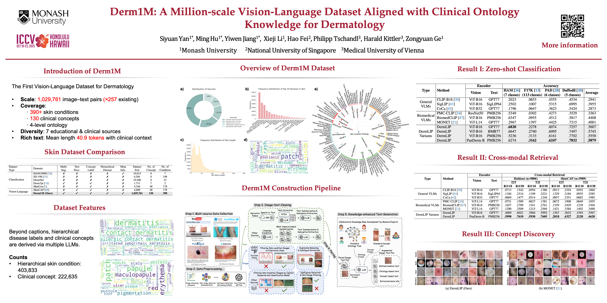

# Derm1M: A Million‑Scale Vision‑Language Dataset Aligned with Clinical Ontology Knowledge for Dermatology
[](https://arxiv.org/abs/2503.14911)
[](#license)
[](#citation)
[](https://huggingface.co/datasets/redlessone/Derm1M)
[](https://huggingface.co/redlessone/DermLIP_ViT-B-16)
[](https://huggingface.co/redlessone/DermLIP_PanDerm-base-w-PubMed-256)


## Updates

- [x] 01/07/2025: Released DermLIP and DermLIP-PanDerm model weights on Hugging Face.
- [x] 03/07/2025: Released evaluation code for downstream tasks.
- [x] 07/09/2025: Released Training code
- [x] 15/10/2025: Derm1M dataset is **public** now

<p align="center">
  
</p>


## ✨ TL;DR

**Derm1M** brings **1,029,761 dermatological image–text pairs** -257× more than any previous dermatology vision‑language corpus—covering **390 skin conditions** and **130 clinical concepts** organised in a four‑level expert ontology. The dataset’s rich contextual captions (mean = 41 tokens) include metadata and other clinical contexts, enabling explainable multimodal learning, zero‑/few‑shot diagnosis, cross‑modal retrieval, and visual question answering in realistic settings.

| Aspect                    | Derm1M                                                          |
|---------------------------|-----------------------------------------------------------------|
| Total image–text pairs    | 1 029 761                                                       |
| Unique images             | 403 563                                                        |
| Skin conditions           | 390 (4-level ontology)                                         |
| Clinical concepts         | 130                                                            |
| Average caption length    | 41 words                                                     |
| Ontology structure        | Structured JSON                                                |
| Image sources             | YouTube, PubMed, medical forums, public datasets, teaching slides |

## 💾 Data Access

The dataset is available on [Hugging Face](https://huggingface.co/datasets/redlessone/Derm1M) for **non-commercial research purposes under the CC BY-NC-4.0 license**. This release differs slightly from the ICCV version, offering improved image quality while preserving comparable model performance.

## 🏗️ Repository Layout

```text
dataset_root/
├── XXX/                   # unzip all zip files
├── Derm1M_v2_pretrain.csv    # text + meta per image for model pretraining
├── Derm1M_v2_validation.csv  # text + meta per image for model validation
├── concept.csv               # extracted concept annotations per image
├── ontology.json             # skin disease hierarchy
```

## 🚀 Pre‑trained Models: **DermLIP**

We provide two CLIP‑style checkpoints trained from scratch on **Derm1M**:

| Model ID            | Vision Encoder | Text Encoder | Zero‑shot Avg† | R\@10 I→T (hold‑out) |
| ------------------- | -------------- | ------------ | -------------- | -------------------- |
| **DermLIP‑B/16**    | ViT‑B/16       | GPT77        | 56.1 %         | 40.7 %               |
| **DermLIP‑PanDerm** | PanDerm‑B      | PMB256       | **58.8 %**     | **59.9 %**           |


## 📊 Key Benchmarks

| Task                                       | Metric    | DermLIP‑PanDerm |  Best Prior SOTA  |       Δ      |
| :----------------------------------------- | :-------- | :-------------: | :---------------: | :----------: |
| Zero‑shot classification (avg. 4 datasets) | Accuracy  |    **58.8 %**   | BiomedCLIP 44.1 % | **+14.7 pp** |
| Few‑shot (10 % labels) linear probe         | Accuracy  |    **69.6 %**   |    MONET 66.9 %   |  **+2.7 pp** |
| Cross‑modal retrieval (SkinCAP)            | R\@10 I→T |    **20.2 %**   |    MONET 14.2 %   |  **+6.0 pp** |

*All metrics are taken directly from Tables 2–4 of the Derm1M paper.*


## 📝 Getting Started

```bash
git clone https://github.com/SiyuanYan1/Derm1M.git
cd Derm1M

conda create -n Derm1M python=3.9.20
conda activate Derm1M
pip install -r requirements.txt
```

## Training
We provide training scripts for two best performance DermLIP models. All training uses the Derm1M dataset with data augmentation and supports distributed training.


Train the PanDerm-base model with PubMed pre-trained text encoder:

```bash
# Run the training script
bash script/pretrain/PanDerm-base-w-PubMed-256.sh

# Or run directly:
python src/main.py \
    --save-frequency 1 \
    --zeroshot-frequency 1 \
    --report-to wandb \
    --wandb-project-name Derm1M_benchmark \
    --train-data="/path/to/your/Derm1M-Folder/Derm1M_v2_pretrain.csv"  \
    --val-data="/path/to/your/Derm1M-Folder/Derm1M_v2_validation.csv"  \
    --csv-caption-key 'truncated_caption' \
    --csv-label-key label \
    --aug-cfg scale='(0.4, 1.0)' color_jitter='(0.32, 0.32, 0.32, 0.08)' color_jitter_prob=0.8 gray_scale_prob=0.2 \
    --csv-img-key 'filename' \
    --warmup 1000 \
    --wd=0.1 \
    --batch-size=2048 \
    --lr=1e-4 \
    --epochs=30 \
    --workers=32 \
    --model PanDerm-base-w-PubMed-256 \
    --logs logs/ \
    --local-loss \
    --grad-checkpointing \
    --dataset-resampled \
    --parent-path '/path/to/your/Derm1M-Folder/'
```


Train a CLIP-B-16 model with OpenAI pre-trained initialization:
```bash
# Run the training script
bash script/pretrain/ViT-B-16.sh

# Or run directly:
python src/main.py \
    --save-frequency 1 \
    --zeroshot-frequency 1 \
    --report-to wandb \
    --wandb-project-name Derm1M_benchmark \
    --train-data="/path/to/your/Derm1M-Folder/Derm1M_v2_pretrain.csv"  \
    --val-data="/path/to/your/Derm1M-Folder/Derm1M_v2_validation.csv"  \
    --csv-caption-key 'truncated_caption' \
    --csv-label-key label \
    --aug-cfg scale="(0.4, 1.0)" color_jitter="(0.32, 0.32, 0.32, 0.08)" color_jitter_prob=0.8 gray_scale_prob=0.2 \
    --csv-img-key filename \
    --warmup 1000 \
    --wd=0.1 \
    --batch-size=4096 \
    --lr=1e-4 \
    --epochs=30 \
    --workers=32 \
    --model ViT-B-16 \
    --logs logs/ \
    --local-loss \
    --grad-checkpointing \
    --dataset-resampled \
    --pretrained openai \
    --parent-path '/path/to/your/Derm1M-Folder/'
```


## Evaluation

Datasets evaluated: PAD, HAM-10000, Fitzpatrick17k, Daffodil

### Setup

1) Download benchmark data from [Google Drive](https://drive.google.com/file/d/1w8Tf74YrHusMqbk72WQjtnninKWTCapu/view?usp=sharing)
2) Unzip to data folder
The directory structure should look like:
```bash
data/
├── Daffodil/
├── derm7pt/
├── F17K/
├── HAM/
├── meta/
├── PAD/
├── pretrain_weight/
└── skincon/
```

### Running Evaluations

### Zero-shot Classification

Evaluate DermLIP models on multiple dermatology datasets using zero-shot classification:

```bash
# Run the zero-shot benchmark script
bash script/zero_shot_benchmark.sh

# Or run individually:

# DermLIP - ViT-B-16
python src/main.py \
    --val-data=""  \
    --dataset-type "csv" \
    --batch-size=1024 \
    --zeroshot-eval1=data/meta/PAD-ZS.csv \
    --zeroshot-eval2=data/meta/HAM-ZS.csv \
    --zeroshot-eval3=data/meta/F17K-ZS.csv \
    --zeroshot-eval4=data/meta/Daffodil-ZS.csv \
    --csv-label-key label \
    --csv-img-key image_path \
    --csv-caption-key 'truncated_caption' \
    --model 'hf-hub:redlessone/DermLIP_ViT-B-16'

# DermLIP - PanDerm-base-w-PubMed-256
python src/main.py \
    --val-data=""  \
    --dataset-type "csv" \
    --batch-size=1024 \
    --zeroshot-eval1=data/meta/PAD-ZS.csv \
    --zeroshot-eval2=data/meta/HAM-ZS.csv \
    --zeroshot-eval3=data/meta/F17K-ZS.csv \
    --zeroshot-eval4=data/meta/Daffodil-ZS.csv \
    --csv-label-key label \
    --csv-img-key image_path \
    --csv-caption-key 'truncated_caption' \
    --model 'hf-hub:redlessone/DermLIP_PanDerm-base-w-PubMed-256'
```

### Linear Probing
Evaluate feature quality through linear probing on downstream classification tasks:

Key parameters in the [script](https://github.com/SiyuanYan1/Derm1M/blob/main/script/linear_prob_benchmark.sh#L6): Ratio of training data


```bash
# Run the linear probing benchmark script
bash script/linear_prob_benchmark.sh
```
### Concept Annotation

Evaluate automatic concept annotation capabilities on clinical and dermascopic dermatology datasets:

Datasets evaluated(After processing): SkinCon, Derm7pt

```bash
# Run the concept annotation benchmark script
bash script/concept_annotation_benchmark.sh
```

### Cross-modal Retrieval

Evaluate cross-modal retrieval performance between images and text descriptions:
Datasets evaluated: Derm1M-Hold Out Dataset, SkinCAP

This script evaluates three models across two datasets for image-text retrieval tasks:
```bash
# Run the cross-modal retrieval benchmark script
bash script/cross_retrieval.sh
```


<a id="citation"></a>
## 📚 Citation


If you find our work useful, please cite:

```bibtex
@misc{yan2025derm1m,
  title        = {Derm1M: A Million‑Scale Vision‑Language Dataset Aligned with Clinical Ontology Knowledge for Dermatology},
  author       = {Siyuan Yan and Ming Hu and Yiwen Jiang and Xieji Li and Hao Fei and Philipp Tschandl and Harald Kittler and Zongyuan Ge},
  year         = {2025},
  eprint       = {2503.14911},
  archivePrefix= {arXiv},
  primaryClass = {cs.CV},
  url          = {https://arxiv.org/abs/2503.14911}
}

@article{yan2025multimodal,
  title={A multimodal vision foundation model for clinical dermatology},
  author={Yan, Siyuan and Yu, Zhen and Primiero, Clare and Vico-Alonso, Cristina and Wang, Zhonghua and Yang, Litao and Tschandl, Philipp and Hu, Ming and Ju, Lie and Tan, Gin and others},
  journal={Nature Medicine},
  pages={1--12},
  year={2025},
  publisher={Nature Publishing Group}
}
```
<a id="license"></a>
## 🛡️ License


Derm1M is released under the **Creative Commons Attribution‑NonCommercial 4.0 International** license. Commercial use requires separate permission.


